# 基于springboot的公司日常考勤系统

---
### 👉作者QQ ：1556708905 微信：zheng0123Long (支持定制修改、部署调试、定制毕设)

### 👉接网站建设、小程序、H5、APP、各种系统等

---

#### 介绍

基于Spring Boot的公司日常考勤系统，旨在简化和优化企业内部的考勤管理流程，提高考勤数据的准确性和管理效率。系统设计了两种角色：管理员和员工。通过对考勤、请假、工资等模块的管理，系统为企业提供了全面的考勤解决方案，实现了考勤信息的自动化处理和高效管理。

#### 技术栈

后端技术栈：Springboot+Mysql+Maven

前端技术栈：Vue+Html+Css+Javascript+ElementUI

开发工具：Idea+Vscode+Navicate

#### 系统功能介绍

管理员角色功能模块  
个人中心：管理员可以在个人中心查看和管理个人信息，包括修改密码和查看系统通知。  
通知公告管理：管理员可以发布和管理企业内部的通知和公告，确保重要信息及时传达给所有员工。  
员工管理：管理员可以添加、修改、删除和查看员工信息，分配员工权限，管理员工档案。  
部门信息管理：管理员可以管理企业内部各部门的信息，包括部门名称、负责人、联系方式等。  
考勤基点管理：管理员可以设定和管理考勤基点，包括工作时间、打卡规则等，确保考勤数据的准确性。  
员工请假管理：管理员可以审批和管理员工的请假申请，记录请假类型、请假时间和请假原因。  
员工考勤管理：管理员可以查看和管理员工的考勤记录，统计员工的出勤情况，生成考勤报表。  
员工工资管理：管理员可以管理和查看员工的工资信息，计算工资数据，生成工资报表。  

员工角色功能模块  
个人中心：员工可以在个人中心查看和管理个人信息，包括修改密码和查看系统通知。  
通知公告管理：员工可以查看企业发布的通知和公告，了解公司最新动态和重要信息。  
部门信息管理：员工可以查看企业内部各部门的信息，包括部门名称、负责人、联系方式等。  
考勤基点管理：员工可以查看考勤基点信息，了解工作时间和打卡规则，确保按时打卡。  
员工请假管理：员工可以提交请假申请，记录请假类型、请假时间和请假原因，并查看请假审批状态。  
员工考勤管理：员工可以查看个人的考勤记录，了解自己的出勤情况，核对考勤数据。  
员工工资管理：员工可以查看个人的工资信息，包括基本工资、奖金、扣款等详细数据。  

#### 系统作用

该系统的主要作用包括：

提高考勤管理效率：系统通过自动化的考勤管理功能，减少了人工操作，提升了考勤数据的录入和统计效率。  
增强信息透明度：系统为员工提供了透明的考勤和工资信息查询功能，员工可以随时查看个人的考勤记录和工资信息，确保信息的透明和准确。  
优化请假审批流程：系统通过在线请假申请和审批功能，简化了请假流程，提高了请假审批的速度和效率。  
加强内部沟通：系统通过通知公告管理功能，确保重要信息及时传达给所有员工，增强了企业内部的沟通和协作。  

#### 系统功能截图

代码结构

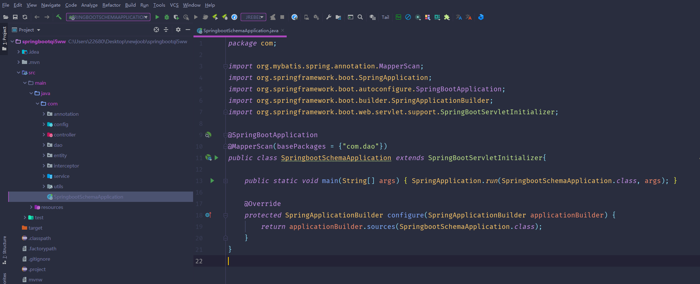

数据库表

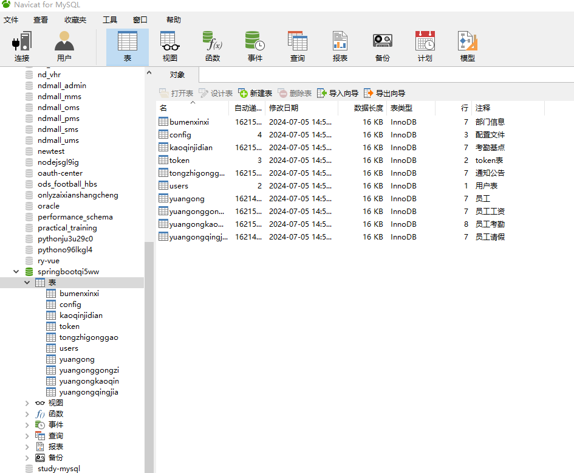

登录

员工端个人信息

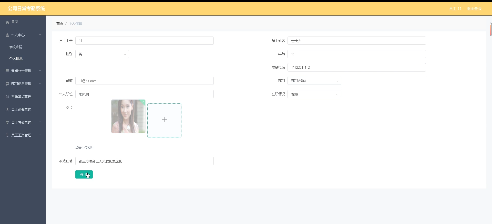

部门信息管理

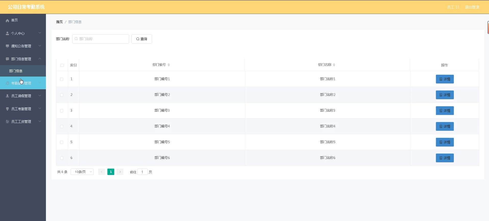

通知公告管理

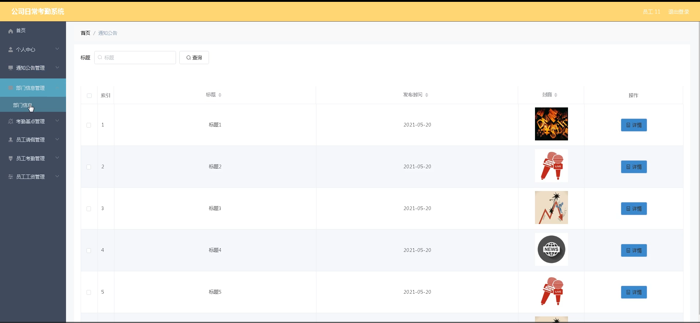

考勤基点管理

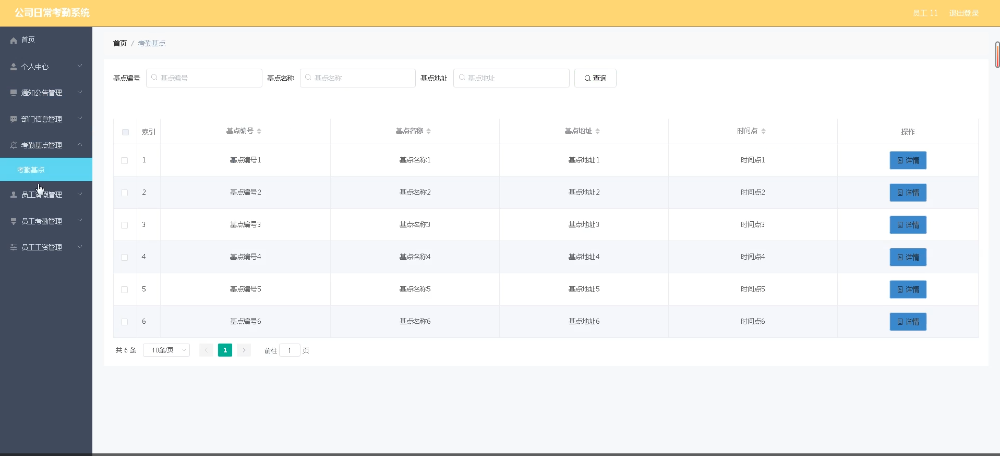

员工请假管理

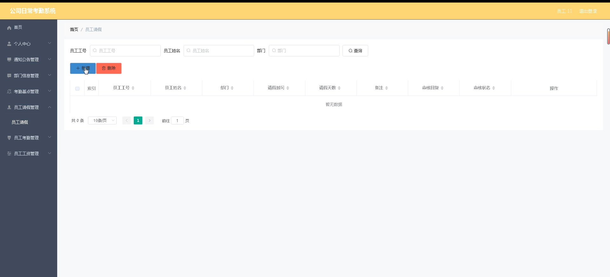

员工考勤管理

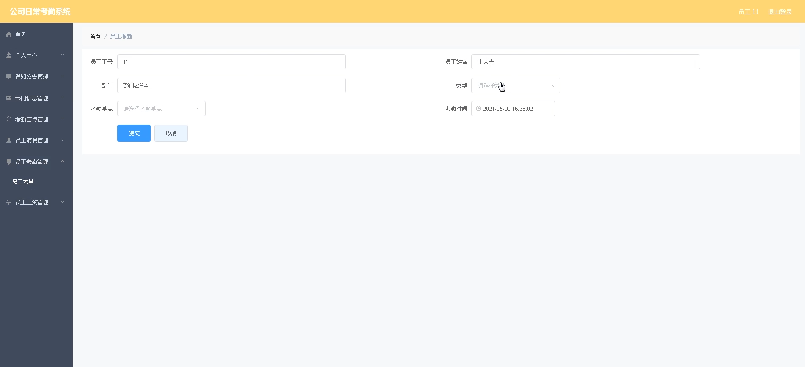

员工工资管理

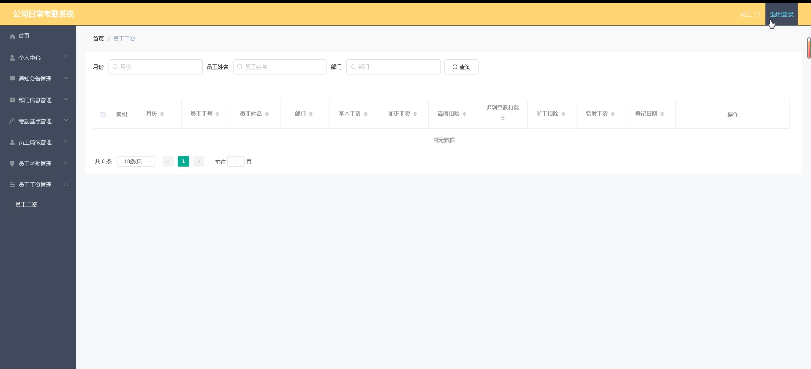

管理员端通知公告管理

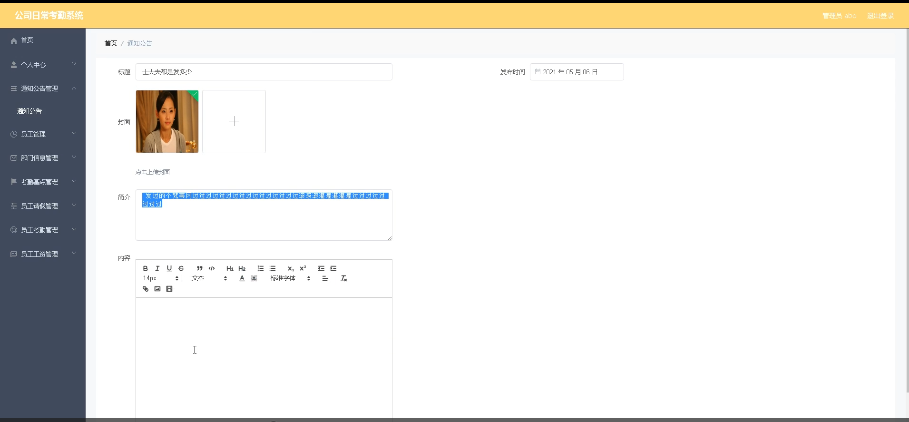

员工管理

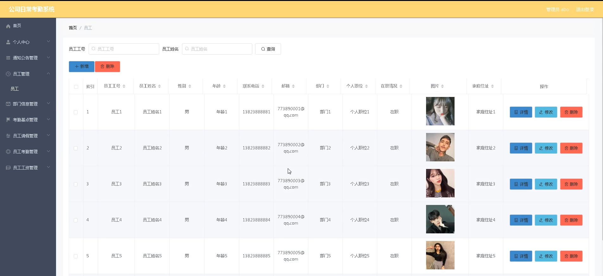

员工请假管理

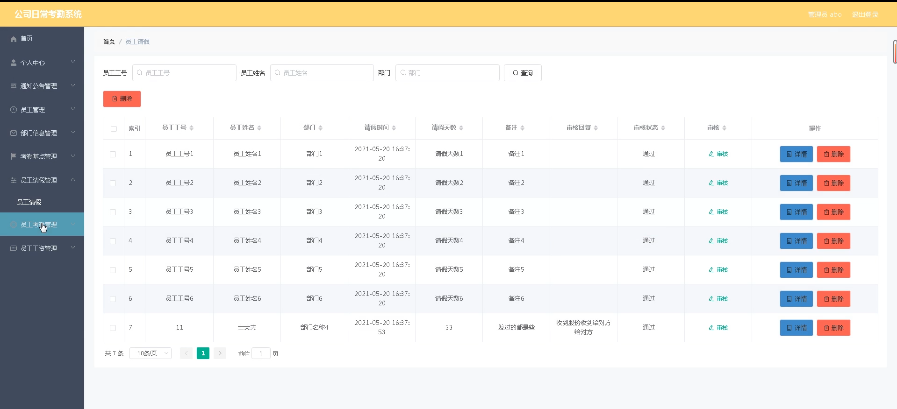

#### 总结

基于Spring Boot的公司日常考勤系统，通过全面的功能模块设计，实现了企业内部考勤管理的高效化和信息化。系统为管理员和员工提供了全面的功能支持，优化了考勤、请假和工资管理流程。通过该系统，企业管理者能够更好地组织和管理员工考勤数据，提高企业的运营效率；员工则能够方便地管理个人信息、查看考勤和工资数据，提升工作体验和满意度。该系统不仅提高了企业的考勤管理水平，还增强了员工的工作体验，为企业的发展提供了有力支持。

#### 使用说明

创建数据库，执行数据库脚本 修改jdbc数据库连接参数 下载安装maven依赖jar 启动idea中的springboot项目

后台地址：http://localhost:8080/springbootqi5ww/admin/dist/index.html

管理员  abo 密码 abo